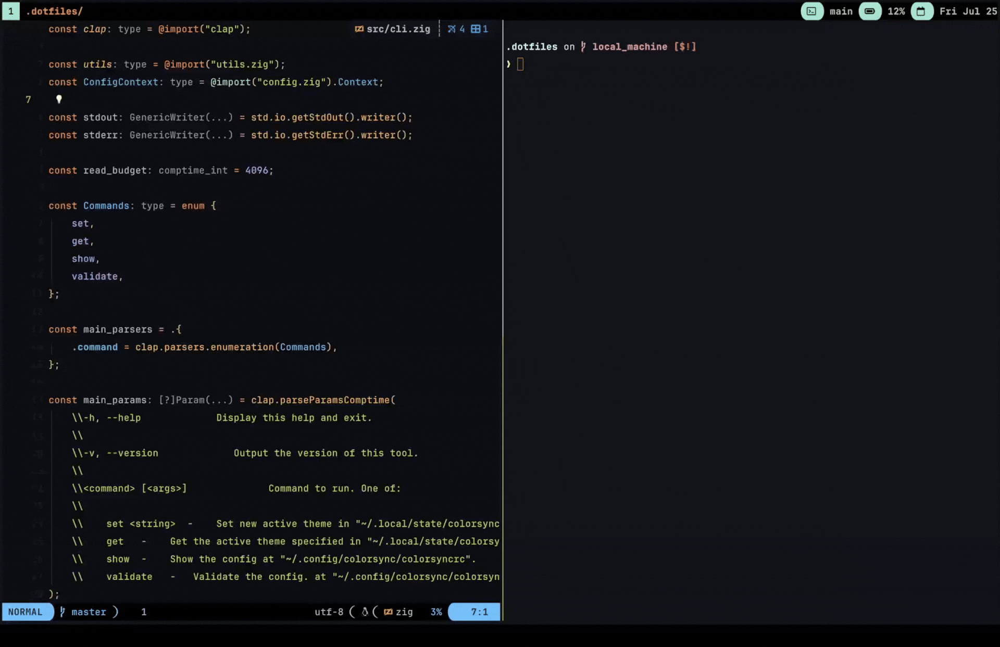
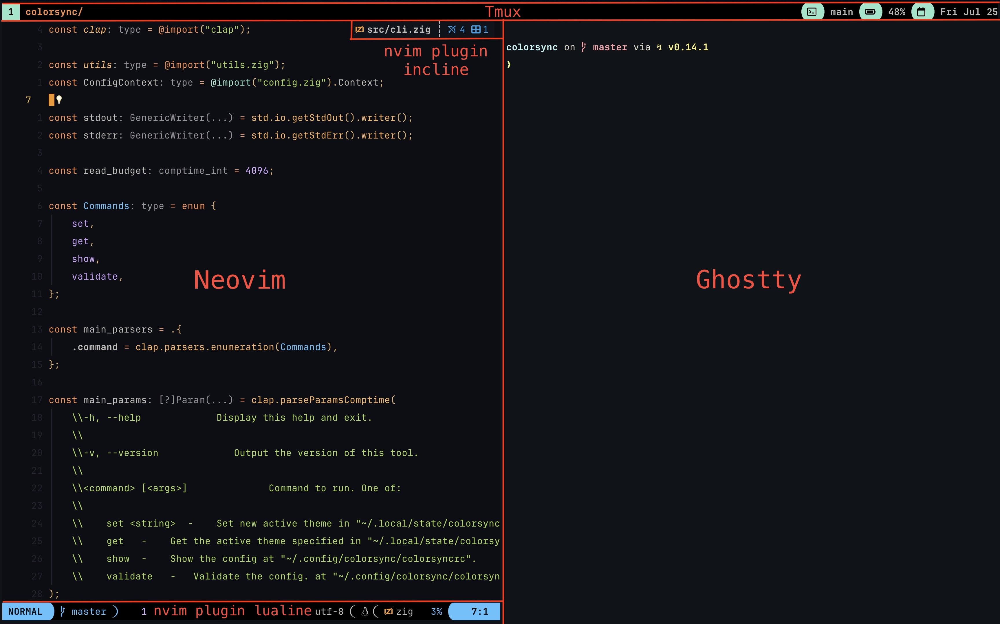

# colorsync

A CLI tool for managing color theme configurations.




## What is this?

This tool is solely responsible for setting a serializable state on your system and providing a convenient way for scriptable applications to read the current state. That’s it. You still need to implement the actual theme switching logic in each application yourself.

For examples of how I’ve achieved this, see my [dotfiles](https://www.github.com/LarssonMartin1998/.dotfiles) repository. A good starting point is my [Ayu colorscheme setup for Neovim](https://github.com/LarssonMartin1998/.dotfiles/blob/main/nvim/lua/plugs/ayu.lua).

Here's a snippet example from my colorscheme setup:
```lua
local function set_colorscheme()
    -- Run the actual colorscheme setup
    -- This will get re run when updating colorsync with a new value.
end

vim.api.nvim_create_augroup("ColorsyncEvents", { clear = true })

local filepath = os.getenv("HOME") .. "/.local/state/colorsync/current"
local handle = uv.new_fs_event()
handle:start(filepath, {}, function()
    vim.schedule(function()
        set_colorscheme()
        -- You can now react off off the ColorsyncThemeChanged event if you need to update plugins as well.
        vim.api.nvim_exec_autocmds("User", { pattern = "ColorsyncThemeChanged" })
        vim.api.nvim_exec_autocmds("ColorScheme", {})
    end)
end)

-- Make sure to also call it outside of the file watching update
set_colorscheme()
```

If you need to switch themes in an application that doesn’t natively support file watching, consider using Watchman to monitor `~/.local/state/colorsync/current` and trigger a script when the file changes.

## Build & Run with Nix

```bash
nix run github:LarssonMartin1998/colorsync#default
```

## Build & Run without Nix

Requires [Zig](https://ziglang.org/).

```bash
zig build run
# binaries can be found here
zig-out/bin/colorsync
```

## Commands

- `set <theme>`
- `get`
- `show`
